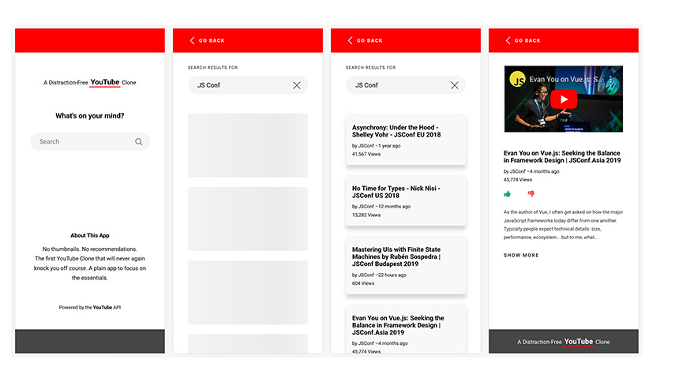

# A Distraction-Free YouTube Clone
> React.js - Built with the [YouTube Data API v3](https://developers.google.com/youtube/v3/)

A YouTube clone in its simplest form - search, watch, and enjoy. I built this small app to get familiar with Axios, React Hooks, Redux, Styled Components, and Skeleton Loaders. As always, if you find any bugs or issues, please let me know. I really like to hear your suggestions for improvements.

[Live Demo](https://elastic-yalow-f28e9d.netlify.com/)



## Installation

```sh
git clone https://github.com/konstantinmuenster/a-distraction-free-youtube-clone
cd a-distraction-free-youtube-clone
npm install
npm start
```

## About

Konstantin Münster – [konstantin.digital](https://konstantin.digital) – [mail@konstantin.digital](mailto:mail@konstantin.digital)

Distributed under the [MIT](http://showalicense.com/?fullname=Konstantin+M%C3%BCnster&year=2019#license-mit) license. 
See ``LICENSE`` for more information.

[https://github.com/konstantinmuenster](https://github.com/konstantinmuenster)